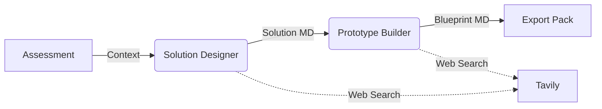

# Workflow Improvement Planner

> **A local, agentic AI workspace for analyzing business processes and generating technical blueprints.**

The **Workflow Improvement Planner** is a Streamlit application that guides you through assessing a business process, analyzing bottlenecks with AI agents, and generating a complete implementation roadmap. It runs locally on your machine, keeping your data private while leveraging OpenAI and Tavily for intelligence and research.

---

## 🚀 Features

- **📂 Local Case Management**: Create, manage, and persist cases on your filesystem. No external database required.
- **📝 Assessment Wizard**: Structured intake form for processes (pain points, actors, systems, SLAs) with attachment support (PDF/TXT/MD).
- **🤖 Dual-Agent Workflow**:
  - **Solution Designer**: Analyzes the assessment to identify bottlenecks, opportunities, and strategic recommendations.
  - **Prototype Builder**: Generates a technical architectural blueprint based on the solution design.
- **🌐 Smart Research**: Agents can browse the web (via Tavily) to find relevant integrations, tools, and best practices.
- **📦 Export Pack**: One-click generation of a downloadable ZIP containing an Executive Brief, Technical Blueprint, and Implementation Plan (Markdown).

---

## 🛠️ Quick Start

### Prerequisites
- Python 3.10+
- [Poetry](https://python-poetry.org/) (recommended) or pip
- OpenAI API Key
- Tavily API Key (for web research)

### Installation

1. **Clone the repository**
   ```bash
   git clone https://github.com/yourusername/workflow-improvement-planner.git
   cd workflow-improvement-planner
   ```

2. **Install dependencies**
   ```bash
   poetry install
   ```

3. **Configure environment**
   Copy the example file and add your keys:
   ```bash
   cp .env.example .env
   ```
   Edit `.env`:
   ```ini
   OPENAI_API_KEY=sk-...
   TAVILY_API_KEY=tvly-...
   OPENAI_MODEL=gpt-4o-mini
   ```

4. **Run the app**
   ```bash
   poetry run streamlit run workflow_planner.py
   ```

---

## 📖 Usage Workflow

1. **Create a Case**: Open the sidebar, enter a name (e.g., "Vendor Onboarding"), area, and tags.
2. **Fill Assessment**: Go to the **Assessment Wizard** tab. Describe the current process, upload documentation (PDFs, diagrams), and save.
3. **Run Solution Designer**: Switch to the **Solution Designer** tab and run the agent. It will analyze your inputs and produce a strategic report.
4. **Run Prototype Builder**: Switch to the **Prototype Builder** tab. This agent uses the Solution output to create a technical spec.
5. **Export**: Go to **Export Pack** to download the full report bundle as a ZIP file.

---

## 🏗️ Architecture

The application follows a clean, modular structure powered by **LangGraph** for orchestration and **Streamlit** for the UI.



### File Structure
```text
.
├── workflow_planner.py  # Main entrypoint & UI components
├── config.py           # Centralized configuration & environment vars
├── schemas.py          # Pydantic models & TypedDicts
├── utils.py            # Persistence, file I/O, & helper functions
├── prompts.py          # LLM system prompts
├── data/               # Local storage (gitignored)
└── docs/               # Documentation & PRDs
```

---

## ⚙️ Configuration

Control the application behavior via `.env`:

| Variable | Description | Default |
|----------|-------------|---------|
| `OPENAI_API_KEY` | Required for agents. | - |
| `TAVILY_API_KEY` | Required for web search. | - |
| `OPENAI_MODEL` | LLM model to use. | `gpt-4o-mini` |
| `MAX_CONTEXT_CHARS` | Limit for input context size. | `60000` |
| `WEB_SEARCH_MAX_RESULTS` | Max links per search query. | `5` |

---

## 🔒 Data Privacy

- **Local First**: All case data, assessments, and outputs are stored in the `data/` directory on your local machine.
- **No Cloud Storage**: We do not send your data to any proprietary cloud database.
- **LLM Privacy**: Data is sent to OpenAI/Tavily only for processing. Refer to their respective privacy policies regarding API usage.

---

## 🤝 Contributing

1. Fork the repo
2. Create your feature branch (`git checkout -b feature/amazing-feature`)
3. Commit your changes (`git commit -m 'Add some amazing feature'`)
4. Push to the branch (`git push origin feature/amazing-feature`)
5. Open a Pull Request

---

Distributed under the MIT License.

